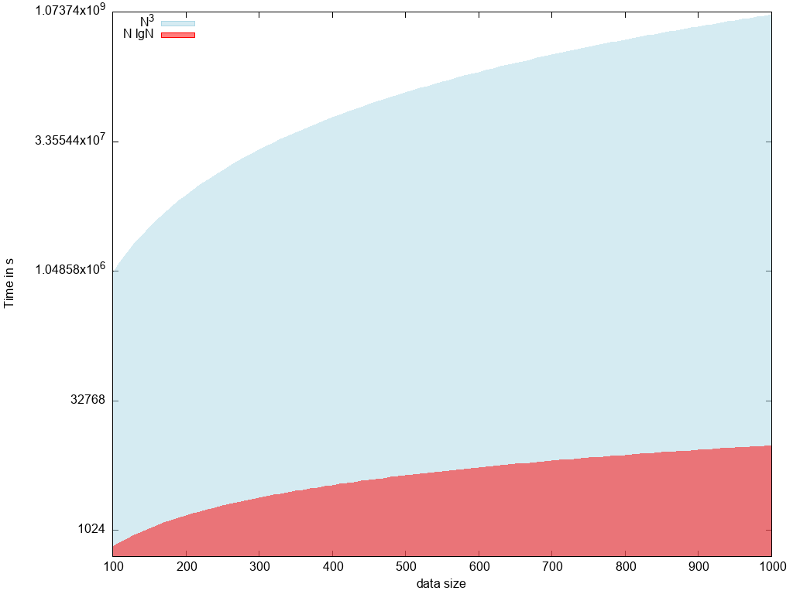
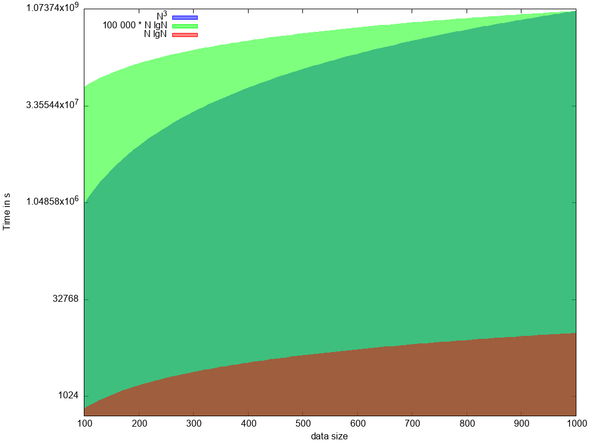

### Supposons que la complexité en temps d'un algorithme soit dans *O(N LogN)* et celle d'un autre dans *O(N3)*, Que peut-on dire de leurs performances comparées ?

Soit un algorithme dont la complexité en temps est approchée par une fonction $`f(n)`$ et un autre dont la fonction est $`g(n)`$.

$$Pour n\ge n_0: $$

$$
f(n) = O(n Log n)$$

$$\displaystyle\left\lvert \frac {f(n)}{n Logn} \right\rvert \le k
 $$

$$
g(n) = O(n^3)$$ 

$$\displaystyle\left\lvert {\frac {f(n)}{n^3} } \right\rvert \le k
 $$

Pour visualiser les choses, traçons les courbes représentatnt les fonction $$N^3$$ et N lg N:

Dans ce graphique, j'ai utilisé une échelle semi-log en y, afin de pouvoir comparer les deux courbes, mais il faut 
bien se rendre compte de la différence d'échelle:

+ n lg n est de l'ordre du millier
+ $$n^3$$ est de l'ordre du milliard ...

Cependant, ces complexités ne nous renseignent pas vraiment sur les performances comparées, puisqu'une fonction peut être dans $N^3$
 pour certaines valeurs, et n lgn la plupart du temps.
De plus un algorithme 100 000 * n lg n, par exemple, obtient des performances moindre qu'un algorithme en 1 * $N^3$, comme le montre le graphique suivant:

