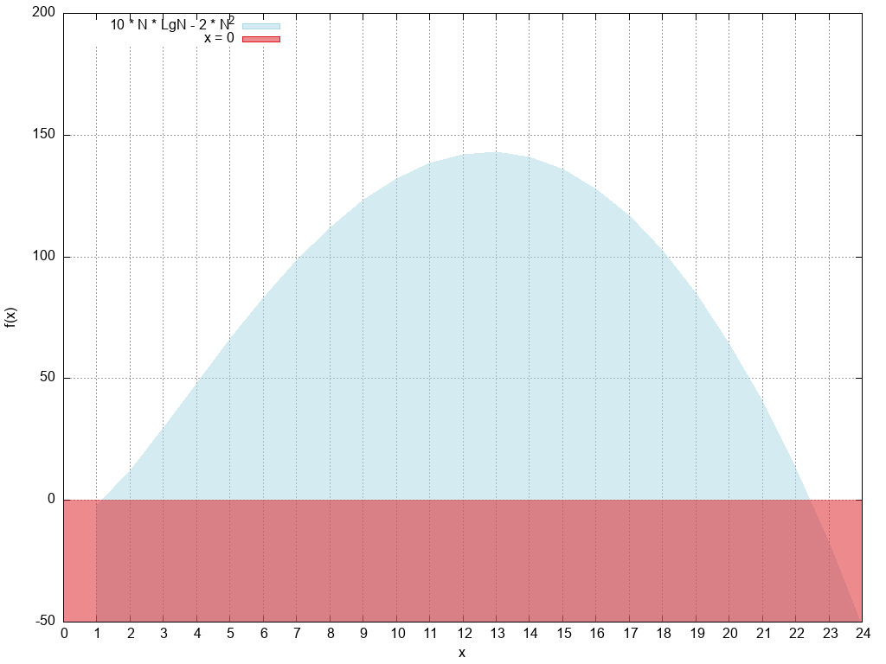

### Pour Quelle valeurs de N on a $$10NlgN>2N^2$$ :

$$10 \times N \times lg_2(N) > 2 \times N^2$$
  
On peut étudier la fonction $$f(x) = 10 \times xlog_2(x)-2x^2$$ sur $$D=]0;+\infty[$$

La fonction est dérivable et nous devons étudier la double dérivé

$$f'(x)=10 \times (log_2(x) + 1) - 4x$$

$$f''(x)=\dfrac{10}{x} - 4$$

f'' s'annule en $\dfrac{10}{4}$

On obtient la courbe de $$f(x)$$

donc la fonction f est positive pour $$2 \le x \le 22$$
